# Active Directory Security Lab (Azure)

## Project Overview
This project simulates a small enterprise Active Directory environment deployed in Microsoft Azure. The lab focuses on identity and access management (IAM), Group Policy enforcement, and PowerShell automation to demonstrate real-world Windows domain administration and SOC-relevant security controls.

The goal was to understand how user identities are managed at scale, how security baselines are enforced, and how misconfigurations or access issues can impact enterprise environments.

---

## Lab Architecture
- Microsoft Azure Virtual Network
- Windows Server 2022 (Domain Controller)
  - Active Directory Domain Services (AD DS)
  - DNS
- Windows 10 Client
  - Joined to the domain
- Organizational Units (OUs) for role separation

> Architecture diagram will be added in a future update.

---

## Tools & Technologies
- Microsoft Azure (Virtual Machines, Networking)
- Windows Server 2022
- Windows 10
- Active Directory Domain Services (AD DS)
- Group Policy Objects (GPO)
- PowerShell
- Windows Security Policies

---

## Implementation Summary

### 1 - Domain Setup
- Installed and configured Active Directory Domain Services on Windows Server 2022
- Promoted the server to a Domain Controller
- Created a custom domain (`SecEng.local`)
- Verified AD DS and DNS functionality

  Screenshots:
- Server Manager
- AD DS installation
- Domain configuration

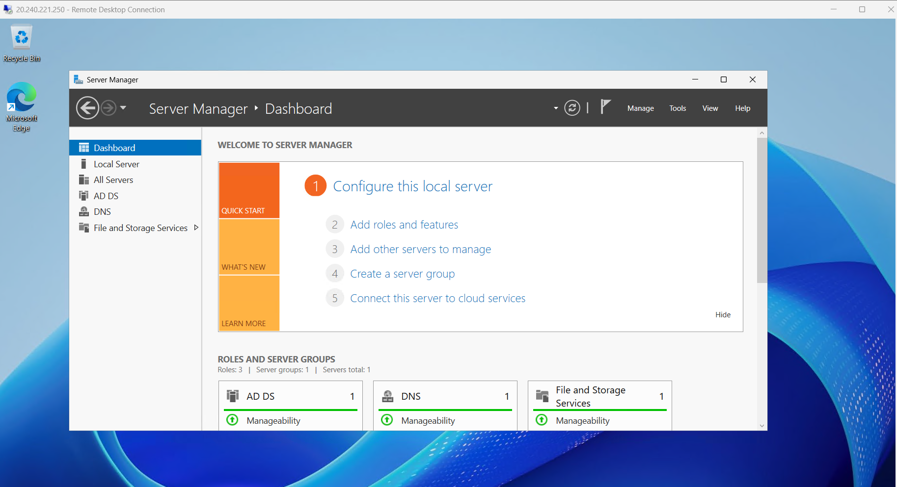 

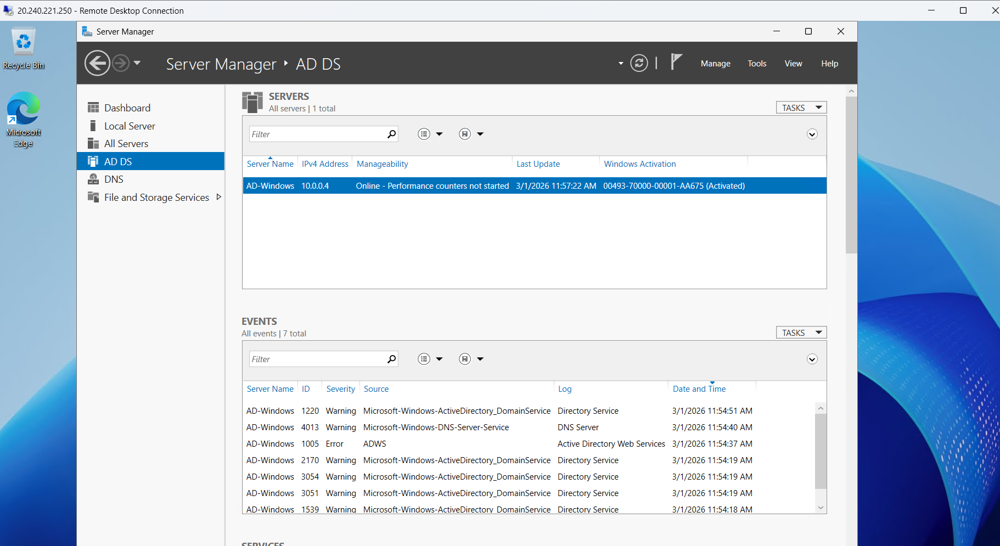

---

### 2️ - Organizational Units (OU) Design
- Created Organizational Units to simulate departments:
  - IT
  - Sales
  - Admin
- Used OUs to apply security policies and manage users at scale

📸 Screenshots:
- OU structure in Active Directory Users and Computers

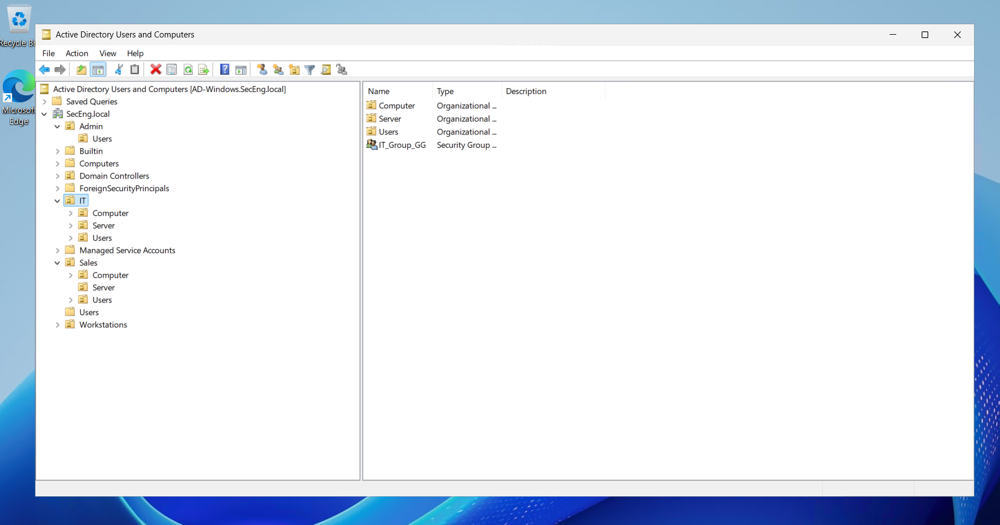

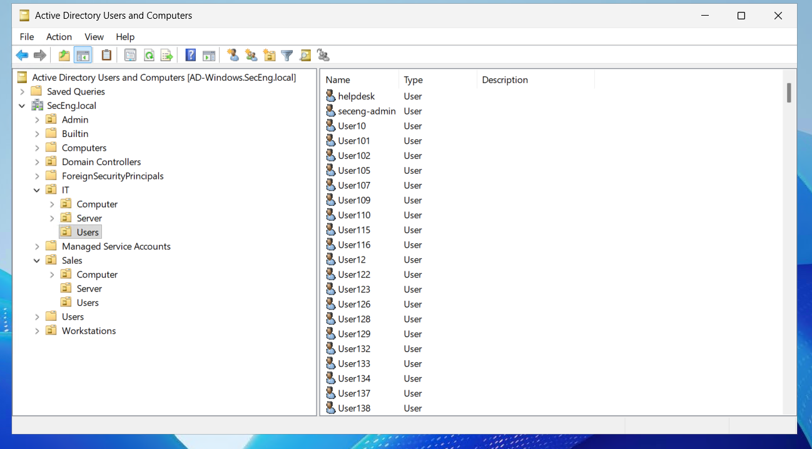

---

### 3️ - Domain-Joined Client
- Deployed a Windows 10 virtual machine
- Successfully joined the client to the domain
- Verified domain authentication using both admin and standard user accounts

  Screenshots:
- Domain-joined client
- Admin login on client machine

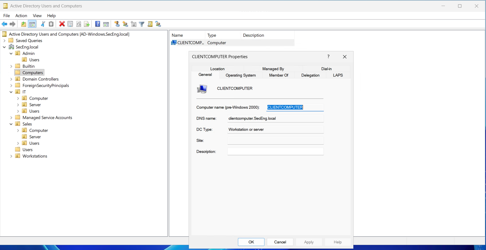

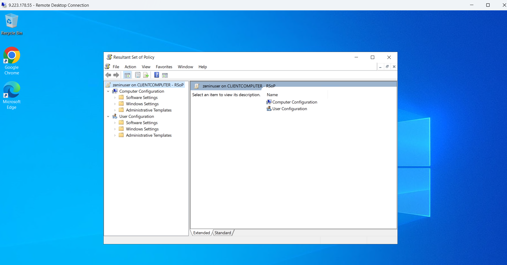

---

### 4️ - Group Policy Enforcement (Security Baselines)
Group Policy Objects (GPOs) were configured to enforce the principle of least privilege and simulate enterprise security controls.

Examples:
- Restricted access to Control Panel
- Enforced user and computer-level policies
- Applied policies through OU-based targeting

  Screenshots:
- User Configuration GPO
- Computer Configuration GPO
- GPO enforcement confirmation

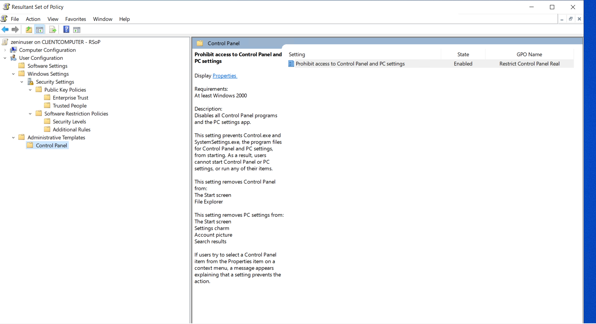

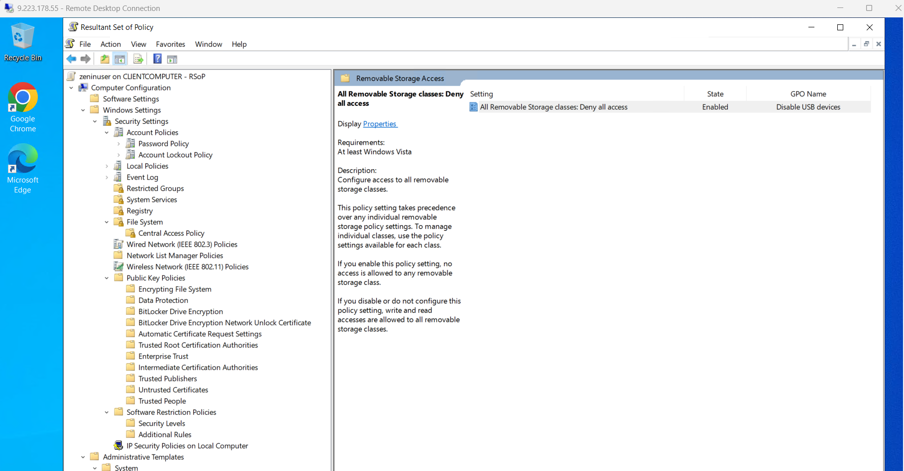

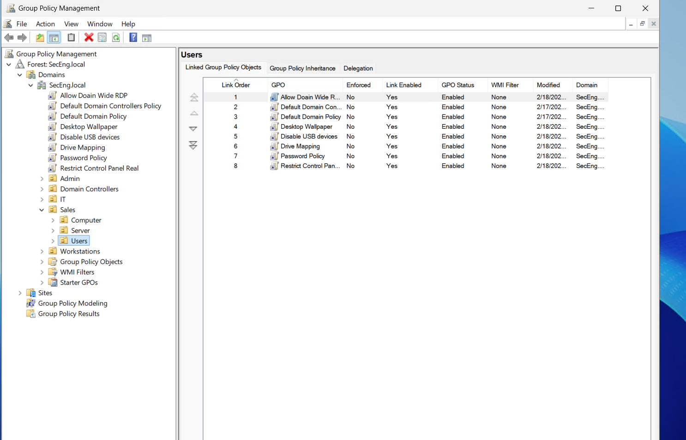

---

### 5️ - PowerShell Automation – Bulk User Provisioning
To simulate an enterprise-scale environment, PowerShell was used to automate user creation.

- Created 1,000 domain users
- Randomly assigned users to Organizational Units
- Enabled accounts with predefined credentials
- Demonstrated automation over manual identity management

  Script:
- `scripts/bulk-user-creation.ps1`

  Screenshot:
- PowerShell execution of bulk user provisioning

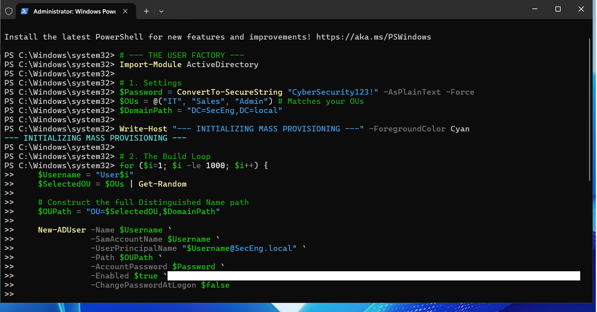

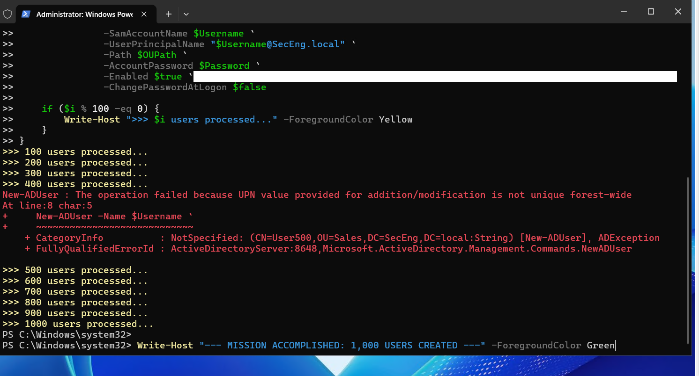
---

## Security & SOC Relevance
This lab directly supports SOC Analyst and Security Engineering fundamentals by demonstrating:

- Identity & Access Management (IAM)
- Active Directory security concepts
- Group Policy enforcement and troubleshooting
- Windows authentication workflows
- PowerShell automation for administrative efficiency
- Understanding of domain-based attack surfaces

These skills are critical for monitoring, investigating, and responding to security incidents in Windows enterprise environments.

---

## Key Takeaways
- Active Directory is central to enterprise security operations
- Misconfigured GPOs or permissions can lead to privilege escalation
- Automation is essential for managing identities at scale
- SOC analysts must understand Windows domains to investigate alerts effectively

---

## Future Improvements
- Add architecture diagram
- Integrate security event logging
- Simulate authentication failures for detection scenarios
- Extend lab with SIEM integration

---

## 👤 Author
**Daniyal Almetayev**  
Cybersecurity & Digital Forensics Graduate  
SOC Analyst / Security Engineering Aspirant
